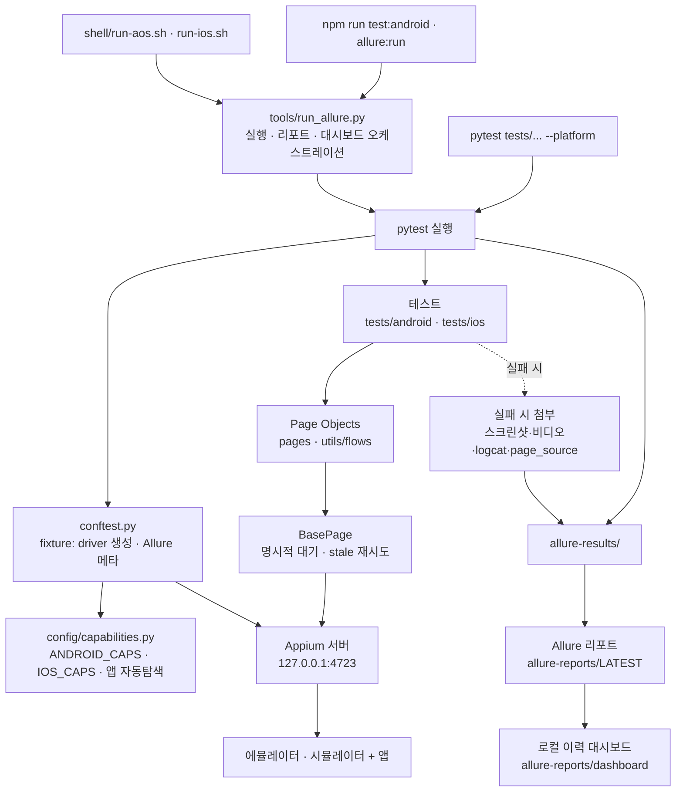
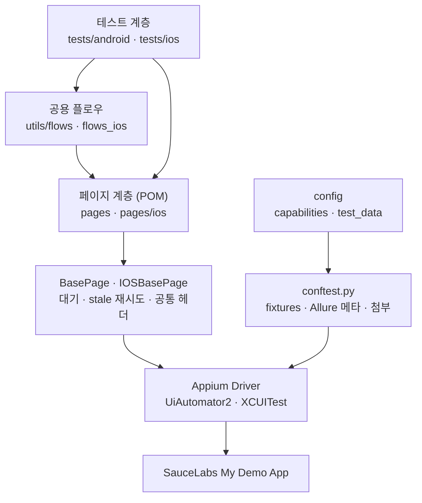

# Appium Mobile Test — SauceLabs My Demo App

## Overview

[SauceLabs My Demo App (네이티브 Android)](https://github.com/saucelabs/my-demo-app-android) E2E
자동화 테스트 프로젝트입니다. Appium + Python 기반으로 Android/iOS 핵심 시나리오(로그인 → 상품 →
카트 → 결제)를 자동 검증합니다.

### 대상 앱: SauceLabs My Demo App

SauceLabs가 **모바일 자동화 테스트 학습·데모용으로 공개한 오픈소스 이커머스 앱**입니다. 실제 쇼핑
앱과 동일한 플로우(상품 카탈로그 → 상세(색상/수량/별점) → 카트 → 로그인 → 결제)를 제공하면서,
요소마다 accessibility id가 잘 부여되어 있어 Appium locator 연습에 적합합니다.

| 항목 | 내용 |
|------|------|
| 배포 | [GitHub Releases](https://github.com/saucelabs/my-demo-app-android/releases) 공개 배포 — 테스트 목적 사용 자유 |
| 테스트 계정 | 앱 로그인 화면에 안내됨 (`bob@example.com` / `10203040` 등 공개 데모 계정) |
| APK 입수 | `shell/bootstrap.ps1`이 자동 다운로드 (`apps/android/`, 검증된 2.2.0 버전 고정) |
| iOS 버전 | [my-demo-app-ios](https://github.com/saucelabs/my-demo-app-ios) (시뮬레이터 빌드 zip 제공) |

### Tech Stack

정확한 핀 버전은 `requirements.txt`(Python) / `package.json`(Node)을 기준으로 합니다. 아래는 현재 핀
기준 요약입니다.

| 기술 | 버전 | 출처 |
|------|------|------|
| Python | 3.10+ | — |
| Node.js | 18+ | — |
| Appium (서버) | `^3.1.2` | `package.json` |
| Appium-Python-Client | `5.2.4` | `requirements.txt` |
| Pytest | `9.0.2` | `requirements.txt` |
| Selenium | `4.39.0` | `requirements.txt` |
| Allure (commandline) | `^2.36.0` | `package.json` |
| allure-pytest | `2.15.3` | `requirements.txt` |
| UiAutomator2 / XCUITest 드라이버 | `^6.9.3` / `^10.28.1` | `package.json` |

---

## 주요 특징

- **Page Object Model** — 화면별 페이지 객체 + `BasePage`/`IOSBasePage` 공통 헬퍼로 locator·동작
  캡슐화
- **안정적인 명시적 대기** — `implicit_wait=0` 고정 + `WebDriverWait` 기반,
  `StaleElementReferenceException` 자동 재시도로 flakiness 최소화
- **Locator 우선순위 준수** — ACCESSIBILITY_ID > Resource ID > XPath
- **Android + iOS 듀얼 플랫폼** — `--platform` 한 옵션으로 동일 시나리오를 양 플랫폼에서 실행
- **Allure 리포트 + 로컬 이력 대시보드** — 실패 시 스크린샷·비디오·logcat·page_source 자동 첨부,
  실행 이력을 로컬 대시보드에 누적(외부 업로드 없음)
- **UI Dump · MCP 도구** — `ui_dump.py`로 빠른 요소 탐색, MCP 세션 레코딩 → pytest 코드 자동 생성

---

## Quick Start

```bash
# 1. 저장소 클론
git clone https://github.com/sphh12/appium_saucelabs.git
cd appium_saucelabs

# 2. 의존성 설치
npm install
pip install -r requirements.txt

# 3. Appium 드라이버 설치
npx appium driver install uiautomator2   # Android
npx appium driver install xcuitest       # iOS (macOS만)

# 4. 환경변수 설정
cp .env.example .env
# .env 파일에 디바이스/대시보드 정보 입력 (모두 선택사항)

# 5. 앱 파일 배치
# Windows: shell/bootstrap.ps1 실행 시 apps/android/ 에 APK 자동 다운로드 (2~5단계를 함께 처리)
# 수동 배치: apps/android/ 에 .apk, apps/ios/ 에 .app/.ipa/.zip
# 다운로드: https://github.com/saucelabs/my-demo-app-android/releases

# 6. 테스트 실행
python tools/run_allure.py -- tests/android/<your_test>.py -v --platform=android
```

> 처음 설정하는 경우 [상세 설치 가이드](#설치-방법)를 참고하세요.

---

## 테스트 실행

### run_allure.py (권장)

테스트 실행 + Allure 리포트 생성 + 로컬 이력 대시보드 갱신을 한번에 처리합니다.
필수 패키지가 없으면 자동으로 설치합니다.

```bash
# Android 테스트
python tools/run_allure.py -- tests/android/<your_test>.py -v --platform=android

# iOS 테스트
python tools/run_allure.py -- tests/ios/<your_test>.py -v --platform=ios

# 리포트 생성 후 브라우저에서 열기
python tools/run_allure.py --open -- tests/android/<your_test>.py -v --platform=android

# 비디오 녹화 포함
python tools/run_allure.py -- tests/android/<your_test>.py -v --platform=android --record-video
```

### Shell 스크립트 (권장)

```bash
# Android 테스트
./shell/run-aos.sh --<your_test>                    # 특정 테스트 파일
./shell/run-aos.sh --<your_test> --test test_login  # 특정 테스트 메서드만
./shell/run-aos.sh --all --report                   # 전체 테스트 + 리포트 열기

# iOS 테스트
./shell/run-ios.sh --<your_test>
```

> - 파일명에서 `.py`는 생략 가능 (`--<your_test>` = `tests/<platform>/<your_test>.py`)
> - 테스트 실행 → Allure 리포트 생성 → 로컬 이력 대시보드 갱신까지 자동 처리

### 수동 실행

```bash
# 터미널 1: Appium 서버
npx appium

# 터미널 2: 에뮬레이터/시뮬레이터
emulator -avd Pixel_6              # Android
open -a Simulator                  # iOS (macOS)

# 터미널 3: 테스트
pytest tests/android/<your_test>.py -v --platform=android
pytest tests/ios/<your_test>.py -v --platform=ios
```

---

## 프로젝트 구조

```
appium_saucelabs/
├── config/
│   ├── capabilities.py          # 디바이스/앱 설정 (ANDROID_CAPS, IOS_CAPS, 앱 자동탐색)
│   └── test_data.py             # 테스트 데이터 중앙관리 (계정/배송/결제)
├── pages/
│   ├── base_page.py             # Android POM 베이스 (명시적 대기 헬퍼 + 공통 헤더)
│   ├── *.py                     # Android 화면별 POM (login/products/cart/checkout 등)
│   └── ios/                     # iOS POM (base_ios_page.py + 화면별 페이지, 하단 탭바)
├── utils/
│   ├── helpers.py               # 유틸리티 (스크롤, 스크린샷 등)
│   ├── flows.py                 # Android 공용 플로우 (로그인/담기→카트 등)
│   └── flows_ios.py             # iOS 공용 플로우
├── tests/
│   ├── android/                 # Android 테스트 (구현됨: login/catalog/cart/checkout 등)
│   └── ios/                     # iOS 테스트 (구현됨: login/catalog/cart/checkout 등)
├── tools/
│   ├── run_allure.py            # Allure 리포트 생성 + 로컬 대시보드 갱신
│   ├── update_dashboard.py      # 로컬 HTML 대시보드 업데이트
│   ├── export_summary.py        # Allure 경량 HTML 요약 Export
│   ├── ui_dump.py               # Android UI 덤프 도구
│   ├── ui_dump_ios.py           # iOS UI 덤프 도구
│   ├── serve.py                 # 로컬 HTTP 서버
│   └── mcp/                     # Appium MCP 도구 세트 (codegen, session_recorder 등)
├── shell/
│   ├── run-app.sh               # 전체 기능 실행 스크립트
│   ├── run-aos.sh               # Android 간편 실행
│   ├── run-ios.sh               # iOS 간편 실행
│   └── bootstrap.ps1            # Windows 초기 설정 스크립트
├── docs/                        # 가이드 문서
├── apps/                        # 앱 파일 (Git 미포함) — android/, ios/
├── conftest.py                  # pytest fixture 설정
├── requirements.txt             # Python 패키지
├── package.json                 # Node.js 패키지
├── .env                         # 환경변수 (Git 미포함)
└── .env.example                 # 환경변수 템플릿
```

---

## 실행 구조

### 실행 파이프라인 (Runtime Flow)

테스트 실행 진입점부터 리포트·대시보드까지의 전체 흐름입니다.



### 코드 레이어 (Architecture)

테스트는 직접 셀렉터를 다루지 않고 페이지 객체(POM)를 통해서만 화면을 조작합니다.



---

## 테스트 커버리지

Android 10개 · iOS 9개 테스트 파일. `--platform` 옵션으로 동일 시나리오를 양 플랫폼에서 실행합니다.
(✅ 구현/통과 · ⚠️ skip · — 미해당)

| 기능 영역 | Android | iOS | 비고 |
|-----------|:-------:|:---:|------|
| 스모크 (앱 실행/카탈로그) | ✅ | — | iOS는 Login/Catalog로 대체 |
| 로그인 (정상·실패·잠긴 계정) | ✅ | ✅ | |
| 상품 카탈로그 / 정렬 | ✅ | ✅ | 가격 정렬 검증은 Android |
| 상품 상세 (수량·색상·담기·별점) | ✅ | ✅ | |
| 카트 (수량 변경·삭제→빈 카트) | ✅ | ✅ | |
| 체크아웃 입력 검증 | ✅ | ✅ | |
| 결제 E2E (로그인→주문 완료) | ✅ | ⚠️ | iOS는 키보드 환경 이슈로 skip |
| 메뉴 / 네비게이션 | ✅ | ✅ | |
| About / 버전 | ✅ | ✅ | |
| WebView (외부 URL) | ✅ | ⚠️ | iOS는 키보드 환경 이슈로 skip |

> ⚠️ iOS 결제 E2E·WebView 2건은 Xcode 26.5 소프트 키보드가 입력 필드를 가리는 환경 이슈로 현재
> `@pytest.mark.skip` 처리되어 있습니다. 마커: `smoke` · `regression` · `e2e` — 실행 필터링은
> [PYTEST_GUIDE.md](docs/PYTEST_GUIDE.md) 참고.

---

## Allure 리포트 & 로컬 대시보드

### 로컬 이력 대시보드

실행할 때마다 `allure-reports/dashboard/`가 갱신되어 실행 이력(통계·소요시간)을 한눈에 볼 수
있습니다. 테스트 결과는 **로컬에만 저장되며 외부로 업로드하지 않습니다**(공개 저장소 정책).

```bash
python tools/serve.py            # 대시보드 열기
python tools/serve.py --latest   # 최신 리포트 열기
```

> 리포트는 데이터를 XHR로 읽어오므로 `file://`로 직접 열면 내용이 표시되지 않습니다. 서버 없이 봐야
> 하면 `allure generate <결과폴더> -o <출력폴더> --clean --single-file`로 단일 HTML을 만드세요.
> 자세한 내용은 [docs/ALLURE_REPORT_GUIDE.md](docs/ALLURE_REPORT_GUIDE.md) §1.2 참고.

### Allure 설치 (최초 1회)

```bash
# macOS
brew install allure

# Windows
scoop install allure
# 또는
choco install allure
```

### 리포트 생성

```bash
# 테스트 실행 + 리포트 생성 + 로컬 대시보드 갱신
python tools/run_allure.py -- tests/android/<your_test>.py -v --platform=android

# 리포트 생성 후 바로 열기
python tools/run_allure.py --open -- tests/android/<your_test>.py -v --platform=android
```

### 로컬 리포트 확인

실행 이력은 `allure-reports/YYYYMMDD_HHMMSS/` 형태로 로컬에도 보관됩니다.

```bash
# 최신 리포트
open allure-reports/LATEST/index.html

# 로컬 대시보드 (간단 서버 필요)
python -m http.server 8000
# http://127.0.0.1:8000/allure-reports/dashboard/
```

상세 가이드: [docs/ALLURE_REPORT_GUIDE.md](docs/ALLURE_REPORT_GUIDE.md)

---

## 환경 설정

### 환경 변수

`.env.example`을 `.env`로 복사한 후 필요한 값을 입력합니다. **모든 변수는 선택사항**이며 미설정 시
기본값이 사용됩니다.

| 변수 | 설명 | 필수 |
|------|------|------|
| `APPIUM_HOST` / `APPIUM_PORT` | Appium 서버 주소 (기본: `127.0.0.1:4723`) | 선택 |
| `ANDROID_UDID` | 실물 디바이스 시리얼 (`adb devices`로 확인) | 실기기 시 |
| `ANDROID_DEVICE_NAME` | 디바이스 이름 (Allure 리포트 표시용) | 선택 |
| `ANDROID_PLATFORM_VERSION` | Android OS 버전 | 선택 |
| `IOS_DEVICE_NAME` / `IOS_PLATFORM_VERSION` | iOS 시뮬레이터 이름/버전 (기본: `iPhone 15` / `17.0`) | 선택 |
| `IOS_UDID` | iOS 시뮬레이터 UUID (다중 시뮬 부팅 시 특정 시뮬 지정) | 다중 시뮬 시 |
| `EXECUTOR_NAME` | Allure 리포트 실행자 표시명 (기본 `local`, OS 사용자명 미기록) | 선택 |

### 앱 파일

앱 파일은 Git에 포함되지 않습니다:

1. `apps/android/`에 `.apk`, `apps/ios/`에 `.app`/`.ipa`/`.zip` 배치
2. 폴더 내 파일이 자동 인식됨 (여러 개면 이름순 마지막 파일 사용, 파일명 지정 불필요)

> 다운로드 — **Android**: https://github.com/saucelabs/my-demo-app-android/releases · **iOS**:
> https://github.com/saucelabs/my-demo-app-ios/releases

### 환경 변수 (시스템)

**macOS:**
```bash
# ~/.zshrc에 추가
export JAVA_HOME=$(/usr/libexec/java_home)
export ANDROID_HOME=$HOME/Library/Android/sdk
export PATH=$PATH:$ANDROID_HOME/platform-tools:$ANDROID_HOME/emulator
```

**Windows:**

| 변수명 | 값 (예시) |
|--------|----------|
| `JAVA_HOME` | `C:\Program Files\Eclipse Adoptium\jdk-17` |
| `ANDROID_HOME` | `C:\Users\{사용자명}\AppData\Local\Android\Sdk` |

PATH에 추가: `%JAVA_HOME%\bin`, `%ANDROID_HOME%\platform-tools`, `%ANDROID_HOME%\emulator`

---

## 설치 방법

> **환경 세팅 통합 가이드**: [docs/SETUP_GUIDE.md](docs/SETUP_GUIDE.md) — 클론부터 첫 실행까지 OS별
> 절차·트러블슈팅을 한 문서로 안내

### 필수 프로그램

| 프로그램 | macOS | Windows |
|----------|-------|---------|
| Node.js 18+ | `brew install node` | https://nodejs.org/ |
| Python 3.10+ | `brew install python@3.10` | https://www.python.org/downloads/ |
| Java JDK 17 | `brew install --cask temurin` | https://adoptium.net/ |
| Android Studio | `brew install --cask android-studio` | https://developer.android.com/studio |
| Allure | `brew install allure` | `scoop install allure` |
| Git | 기본 설치됨 | https://git-scm.com/ |

### 설치 순서

1. **필수 프로그램 설치** (위 표 참고)

2. **환경 변수 설정** (위 [환경 설정](#환경-설정) 참고)

3. **Android 에뮬레이터 생성**
   - Android Studio → Tools → Device Manager
   - Pixel 6 + API 34 권장

4. **프로젝트 설정**
   ```bash
   git clone https://github.com/sphh12/appium_saucelabs.git
   cd appium_saucelabs
   npm install
   npx appium driver install uiautomator2
   pip install -r requirements.txt
   cp .env.example .env
   # .env 파일 편집 (선택)
   ```

5. **iOS 설정 (macOS만)**
   ```bash
   npx appium driver install xcuitest
   # Xcode + 시뮬레이터 설치 필요
   ```
   상세 가이드: [docs/SETUP_GUIDE.md](docs/SETUP_GUIDE.md) §4 (iOS 추가 세팅)

6. **설치 확인**
   ```bash
   npx appium --version
   npx appium driver list --installed
   python -c "import pytest; print(pytest.__version__)"
   python -c "from config.capabilities import ANDROID_CAPS; print(ANDROID_CAPS['appPackage'])"
   ```

---

## 문서

| 문서 | 설명 |
|------|------|
| [ALLURE_REPORT_GUIDE.md](docs/ALLURE_REPORT_GUIDE.md) | Allure 리포트 탭별 설명, 분석 루틴, 진단 파일 활용 |
| [APP_STRUCTURE.md](docs/APP_STRUCTURE.md) | 대상 앱 기능 인벤토리 (테스트 시나리오 범위) |
| [UI_DUMP_GUIDE.md](docs/UI_DUMP_GUIDE.md) | UI Dump 도구 사용법, XML 분석, Locator 전략 |
| [PYTEST_GUIDE.md](docs/PYTEST_GUIDE.md) | pytest 실행 옵션, 마커, 필터링 |
| [CODING_GUIDELINES.md](docs/CODING_GUIDELINES.md) | 테스트 스크립트 작성 규칙 |
| [SETUP_GUIDE.md](docs/SETUP_GUIDE.md) | **환경 세팅 통합 가이드** (클론·Windows·macOS·iOS + 트러블슈팅) |
| [IOS_TEST_GUIDE.md](docs/IOS_TEST_GUIDE.md) | iOS 테스트 작성 가이드 |
| [MCP_SETUP_GUIDE.md](docs/MCP_SETUP_GUIDE.md) | Appium MCP 도구 설치/연결 |
| [MCP_RECORD_GUIDE.md](docs/MCP_RECORD_GUIDE.md) | MCP 세션 레코딩 → 코드 생성 |
| [CI_GUIDE.md](docs/CI_GUIDE.md) | **GitHub Actions 사용법** (트리거·야간 회귀·리포트 확인) |
| [CI_CD_STRATEGY.md](docs/CI_CD_STRATEGY.md) | CI/CD 파이프라인 전략 (플랫폼·한도 비교) |

---

## 문제 해결

| 에러 | 원인 | 해결 |
|------|------|------|
| `ConnectionRefusedError` | Appium 서버 미실행 | `npx appium` |
| `No device found` | 에뮬레이터 미연결 | `adb devices`로 확인, 에뮬레이터 시작 |
| `App not found` | 앱 파일 없음 | `apps/android/` 또는 `apps/ios/`에 앱 파일 복사 |
| `NoSuchElementException` | Locator 오류 | `python tools/ui_dump.py -w`로 확인 |
| `No module named 'pytest'` | Python 패키지 미설치 | `pip install -r requirements.txt` |
| `JAVA_HOME is not set` | 환경 변수 미설정 | 시스템 환경 변수에 추가 |

---

## Appium Inspector

UI 요소를 탐색하는 도구입니다.

**다운로드:** https://github.com/appium/appium-inspector/releases

**설정:**
| 항목 | 값 |
|------|-----|
| Remote Host | `127.0.0.1` |
| Remote Port | `4723` |
| Remote Path | `/` |

> Appium Inspector 대신 `python tools/ui_dump.py -w` (Watch 모드)를 사용하면 더 빠르게 UI 요소를
> 확인할 수 있습니다.

---

## 참고 링크

- [SauceLabs My Demo App (Android)](https://github.com/saucelabs/my-demo-app-android)
- [SauceLabs My Demo App (iOS)](https://github.com/saucelabs/my-demo-app-ios)
- [Appium 공식 문서](https://appium.io/docs/en/latest/)
- [Appium Inspector](https://github.com/appium/appium-inspector/releases)
- [Pytest 문서](https://docs.pytest.org/)
- [Allure Report](https://docs.qameta.io/allure/)
