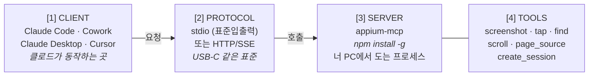

# Appium MCP 개념 가이드

> **마지막 업데이트**: 2026-04-29
> **대상**: QA 엔지니어 (모바일 자동화 입문 ~ 중급)
> **프로젝트**: SauceLabs My Demo App Appium Test

---

## 1. MCP가 뭔가?

### 한 줄 정의

**MCP (Model Context Protocol)** = LLM(클로드)이 **외부 도구를 안전하게 호출**할 수 있게 해주는 **표준 통신 규칙**.

### 1.1. 왜 만들어졌나 — Before / After

| 항목 | Before (MCP 없을 때) | After (MCP 있을 때) |
|------|---------------------|---------------------|
| 화면 확인 | 사용자가 매번 `ui_dump.py` 돌려서 결과 갖다줌 | 클로드가 직접 "스크린샷 찍어줘" 호출 |
| 액션 | 사용자가 코드 짜고 직접 실행 | 클로드가 "이 버튼 탭" 직접 명령 |
| 사이클 | 한 번 왕복에 5~10분 | 1~10초 |

### 1.2. 비유 — USB-C 케이블

**USB-C가 표준이라서** 노트북·휴대폰·모니터·카메라가 **같은 포트로 연결**되는 것처럼, MCP도 같은 역할을 한다. 어떤 LLM 클라이언트(Claude, GPT, Gemini 등)든 어떤 외부 도구(Appium, GitHub, Notion)든 **같은 규칙으로 연결**되도록 만든 표준.

USB-C가 없던 시절엔 노트북마다 다른 충전기를 써야 했지. MCP가 없던 시절엔 클로드도 도구마다 별도 통합 코드를 짜야 했음. 이제는 표준화됨.

> **핵심 가치**: 클로드가 "화면을 직접 본다 → 의도를 이해한다 → 다음 액션을 능동적으로 실행한다"는 사이클이 사용자 개입 없이 빠르게 반복됨.

---

## 2. 4가지 핵심 구성 요소



### 2.1. 각 요소를 한 줄로

| 요소 | 정체 | 예시 |
|------|------|------|
| **CLIENT** | 클로드가 동작하는 환경 | Claude Code, Cowork, Claude Desktop, Cursor |
| **PROTOCOL** | 둘 사이 통신 규약 (USB-C 표준) | stdio (표준입출력) 또는 HTTP/SSE |
| **SERVER** | 실제 동작하는 도구 모음 프로세스 | `appium-mcp`, `mcp-server-puppeteer` 등 |
| **TOOLS** | 서버가 제공하는 "함수" 메뉴 | `screenshot`, `tap`, `find_element`, `create_session` |

### 2.2. 핵심 포인트

- **Server는 "서버"라는 이름이지만 클라우드가 아님** — 너 PC에서 도는 작은 프로세스 (stdio 모드)
- **Client마다 별도 등록 필요** — Claude Code에 등록한 MCP가 Cowork에 자동으로 안 보임
- **하나의 Client가 여러 Server 동시 사용 가능** — Notion, Vercel 등도 같이 등록 가능
- **Tools는 LLM 입장의 "함수"** — 클로드가 의도하면 MCP가 실제 호출로 변환
- **capabilities.json은 MCP Server의 설정 파일** — 어떤 디바이스/앱을 다룰지 알려줌

---

## 3. 실제 동작 흐름 — 스크린샷 한 번 찍어보기

사용자가 채팅창에 **"Take a screenshot"**이라고 한 줄 입력했을 때 실제로 일어난 일:

```
① 사용자: "Take a screenshot"
       ↓
② Claude Code: 의도 파악 + 도구 선택
       ↓
③ MCP Protocol (stdio): JSON-RPC 메시지 전달
       ↓
④ appium-mcp 서버: appium_screenshot() 함수 호출
       ↓
⑤ Appium 서버 (localhost:4723): UiAutomator2 → ADB 명령
       ↓
⑥ 에뮬레이터 (emulator-5554): 화면 PNG 캡처
       ↓ (역순으로 응답 반환)
⑦ 클로드가 PNG 파일 직접 봄 (멀티모달 분석):
   "이 화면은 My Demo App 메인(상품 목록) 화면이고,
    상단에 장바구니 아이콘이 있으며,
    여러 상품 카드가 노출되어 있습니다…"
   → 다음 액션 자동 추천 (탭, 입력, 검증 등)
```

### 핵심 관전 포인트

**사용자가 한 일은 단 한 줄 입력. 끝.**

화면을 한 번도 직접 캡처하지 않았다. 클로드가 능동적으로 "지금 화면이 뭐지?"를 묻고 답을 받아 분석한 것. 이게 1순위 MCP 도입의 핵심 가치.

---

## 4. 우리 프로젝트에 매핑하기

지난 며칠간 한 작업을 위 그림 위에 점찍어보면:

| 우리가 만든 것 | 그림에서 위치 | 역할 |
|---|---|---|
| `npm install -g appium-mcp` | ④ 박스 | MCP 서버 본체 설치 |
| `claude mcp add appium-mcp ...` | ② ↔ ④ 사이 연결선 | 클라이언트가 서버를 알 수 있게 등록 |
| `tools/mcp/capabilities.json` | ④ 옆 명세서 | 서버에게 "어떤 디바이스/앱 다룰지" 알려줌 |
| `NO_UI=true` 환경변수 | ④ 응답 옵션 | PNG를 base64로 부풀리지 말고 파일 경로만 반환 (토큰 60~90% 절감) |
| UIA2 안정화 옵션 8개 | ⑤ Appium 설정 | 드라이버 인스트루멘테이션 크래시 완화 |
| `docs/MCP_SETUP_GUIDE.md` | 전체 매뉴얼 | 다른 머신(Win/Mac)에서 재현 가능하게 정리 |

### 4.1. 검증 결과 (Windows 회사 PC)

- Node.js v24.11.1 / ANDROID_HOME / APK / Appium 서버 사전점검 7개 항목 모두 통과
- `appium-mcp` 글로벌 설치 → Claude Code 등록 → ✓ Connected 확인
- `select_device` · `create_session` · 스크린샷 · page_source · 요소 탭 모두 동작
- 발견 이슈 즉시 해결: `NO_UI=true` 적용 + capabilities 안정화 옵션 추가

---

## 5. 헷갈리기 쉬운 점 5가지

### 5.1. "서버"인데 클라우드가 아니다

`appium-mcp`는 **너 PC에서 도는 프로세스**다. `claude mcp list`에 ✓ Connected가 떴을 때 실제로 일어난 일:

- Claude Code가 백그라운드에서 `appium-mcp` 명령을 실행
- stdio (표준입출력) 파이프로 연결
- 두 프로세스가 같은 PC 안에서 대화

**왜 "서버"라고 부르냐**: HTTP 서버처럼 "도구를 제공하는 쪽"이라는 의미. 위치(클라우드)가 아니라 역할(provider)을 가리키는 단어.

### 5.2. Cowork와 Claude Code는 별개의 클라이언트

지금 이 채팅(Cowork)에서는 `appium_*` 도구를 호출할 수 없다. **Claude Code에 등록한 MCP는 Claude Code에서만 동작**.

비유: 회사 노트북에 USB-C 어댑터 꽂아도 집 노트북엔 안 꽂힘 — 각 노트북마다 따로 꽂아야 함.

### 5.3. appium-mcp ≠ Appium

| 구분 | 설명 |
|------|------|
| **Appium 서버** (`localhost:4723`) | 이미 있던 거. 디바이스 자동화의 본체. |
| **appium-mcp** | 그 위에 새로 얹은 **얇은 통역 레이어**. LLM이 이해하는 도구 형태로 Appium 기능을 노출. |

비유: Appium은 "한국어 잘하는 전문가", appium-mcp는 "그 전문가의 통역사" (LLM의 영어 의도 → Appium의 한국어).

### 5.4. capabilities.json은 MCP의 명세서

이게 없으면 MCP 서버는 "어떤 앱?", "어떤 디바이스?", "어떤 환경?"을 모른다. 우리가 `generate_capabilities.py` 만든 이유:

- 매번 손으로 쓰면 사람마다 경로가 다르고 실수가 발생
- `.env` + `apps/` 폴더를 자동 읽어 일관되게 생성
- Windows ↔ macOS 머신 전환 시 같은 스크립트로 재생성 가능

### 5.5. 도구(Tools)는 LLM 입장의 함수

`screenshot`, `tap`, `find_element` 등 — 클로드가 "이 함수를 호출해야겠다"고 판단하면 MCP가 실제 함수 호출로 변환한다. **클로드 입장에선 사용할 수 있는 함수 라이브러리가 늘어난 것**과 같다.

---

## 6. 한 줄 요약

> **MCP는 클로드가 외부 도구(우리 경우 Appium)를 호출할 수 있게 해주는 표준이고, 우리는 그 표준에 맞춰 "Appium 통역사(appium-mcp)"를 너 PC에 설치하고 클로드(Claude Code)에 등록해서 화면을 직접 보고 조작하게 만들어준 것이다.**

---

## 참고 자료

- **설치/검증 가이드**: `docs/MCP_SETUP_GUIDE.md` (Windows + macOS 통합)
- **단계별 실행 계획**: `docs/MCP_단계별_실행계획.md` (Phase 1/2/3 검토용)
- **설정 자동 생성**: `tools/mcp/generate_capabilities.py`
- **등록 스크립트**: `tools/mcp/samples/claude-code-add.sh` · `.ps1`
- **공식 저장소**: [github.com/appium/appium-mcp](https://github.com/appium/appium-mcp) · [github.com/modelcontextprotocol](https://github.com/modelcontextprotocol)
