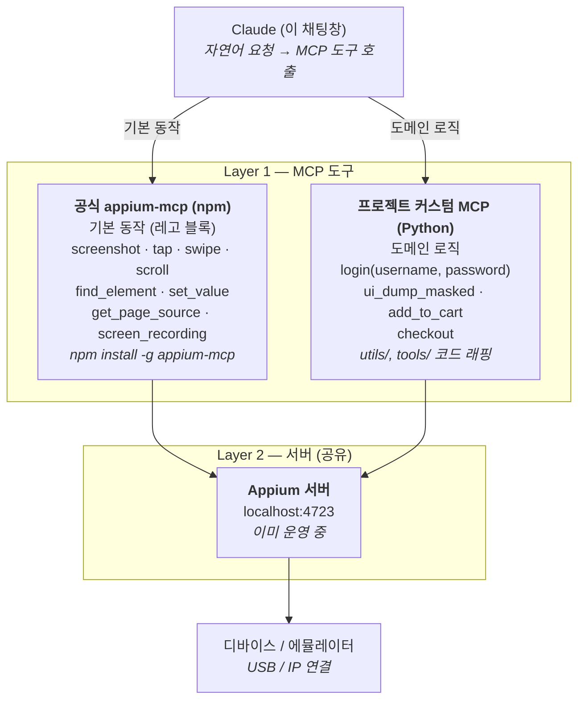

# Appium MCP — 2-Layer 전략 및 단계별 실행 계획

> **마지막 업데이트**: 2026-04-29
> **대상**: QA 엔지니어 — Phase 2/3 검토 의사결정용
> **참고**: `docs/MCP_SETUP_GUIDE.md` (Phase 1 설치/검증), `docs/MCP_개념_가이드.md` (개념)

---

## Phase 요약

| Phase | 상태 | 내용 |
|-------|------|------|
| **Phase 1** | ✅ 검증 완료 (Windows) | 공식 appium-mcp 도입 |
| **Phase 2** | 📝 검토 대상 | 프로젝트 커스텀 MCP |
| **Phase 3** | 🔮 장기 (선택) | 자기 검증 루프 + AI Vision |

---

## 1. 배경 — 왜 2-Layer 접근인가

### 1.1. 핵심 발견

Appium 공식팀이 만든 **[appium/appium-mcp](https://github.com/appium/appium-mcp)** 가 이미 1.56.1 버전으로 활발히 운영 중 (314 stars, 119 릴리즈, 가장 최근 2026-04-14). 우리가 원하던 기능 거의 다 들어있음.

### 1.2. 공식 도구가 제공하는 것

- 스크린샷 / 페이지 소스 / 화면 녹화
- tap, click, swipe, scroll, drag, pinch, long press, double tap 등 모든 제스처
- 앱 관리 (install, launch, terminate, deep_link, clear, permissions)
- iOS Simulator 부팅, WDA 자동 설치
- **AI Vision 모드** (자연어로 "노란 검색 버튼" 찾기 — 비전 모델 통합)
- 한국어 지원 + Page Object 자동 생성, locator 추천

### 1.3. 그래도 부족한 부분 — 우리 프로젝트만의 도메인 로직

| 프로젝트 특화 로직 후보 | 공식 MCP에 있나? |
|---|---|
| 로그인 플로우 헬퍼 (아이디/비밀번호 입력 → 검증) | ❌ 없음 (`utils/helpers.py`에 추가) |
| UI Dump 민감정보 마스킹 (전화/이메일/생년월일) | ✅ 일부 (`tools/ui_dump.py`) |
| 장바구니/결제 플로우 헬퍼 | ❌ 없음 (작성 예정) |

> **결론**: 공식 MCP는 **레고 블록**, 우리 프로젝트 코드는 **완성된 모델**. 둘을 같이 써야 가치가 나옴. 그래서 "2-Layer 접근".

---

## 2. 2-Layer 아키텍처



### 핵심 디자인 원칙

> Layer 1의 두 MCP가 충돌 없이 협업하려면 **한쪽만 세션을 생성**해야 한다. 공식 MCP가 세션을 만들면 커스텀 MCP는 그 세션을 공유 사용 (또는 반대). 세션 소유권은 시작 시 명시적으로 결정.

---

## 3. 단계별 실행 계획

### Phase 1 · 공식 appium-mcp 도입 + 검증 ✅ 완료

**목표**: 별도 코딩 없이 공식 도구만으로 어디까지 되는지 검증.
**예상 시간**: 1~2시간 / **실제**: 회사 PC 검증 완료, macOS 잔여

| # | 작업 | 예상 | 검증 기준 |
|---|------|------|-----------|
| 1-1 | Node.js v22 이상 확인 | 1분 | `node -v` v22+ |
| 1-2 | `capabilities.json` 작성 | 10분 | 기존 `config/capabilities.py` 매핑 |
| 1-3 | Cowork/Claude Code MCP 등록 | 5분 | 도구 목록에 `appium_*` |
| 1-4 | 에뮬레이터 + 기본 동작 5개 테스트 | 30분 | screenshot / page_source / tap / swipe / set_value |
| 1-5 | 한국어 자연어 명령 시도 | 30분 | 의도대로 동작 |

**산출물**: `docs/MCP_SETUP_GUIDE.md`, `tools/mcp/` 폴더 (generate_capabilities.py, 등록 스크립트, 샘플 JSON)

> **의사결정 포인트 결과**: Phase 1 만족도 **~85%** (스크린샷·page_source·요소 탭 모두 정상 동작, NO_UI + UIA2 안정화 옵션 적용 후 안정성 확보) → 기준선 80% 이상이므로 **Phase 2 도입은 후순위**로 보류 가능.

---

### Phase 2 · 프로젝트 커스텀 MCP 📝 검토 대상

**목표**: 프로젝트만의 도메인 로직을 MCP 도구로 노출.
**예상 시간**: 1~2일

| # | 작업 | 예상 | 비고 |
|---|------|------|------|
| 2-1 | `tools/mcp_server/` 생성 + Python MCP SDK 설치 | 30분 | `pip install mcp` |
| 2-2 | 기본 골격 (`server.py`) — stdio 통신 | 30분 | 공식 SDK 템플릿 |
| 2-3 | `login` 헬퍼 → `mcp_login` 도구 래핑 | 1시간 | username/password 인자 |
| 2-4 | 기존 `tools/ui_dump.py` → `mcp_dump_masked` | 1시간 | 마스킹 옵션 포함 |
| 2-5 | `mcp_add_to_cart` 도구 (상품 → 장바구니) | 30분 | 상품 선택/담기 플로우 |
| 2-6 | 클라이언트 등록 + 검증 | 30분 | Claude Code 한 줄 등록 |

#### 도입 결정 기준

| 현재 병목 | Phase 2 효과 |
|---|---|
| "로그인 매번 보안 키보드 코드 직접 짜기 귀찮다" | ⭐⭐⭐⭐⭐ 큼 |
| "UI Dump 마스킹 후처리가 번거롭다" | ⭐⭐⭐⭐ 큼 |
| "상품→장바구니→결제 플로우를 매번 직접 짜기 번거롭다" | ⭐⭐⭐ 보통 |
| "공식 MCP 만으로도 충분히 빠르고 정확하다" | ⭐ 작음 (보류 권장) |

> **검토 트리거**: 본격 자동화 코드 작성에 진입했을 때 또는 같은 도메인 로직(보안 키보드/마스킹 등)을 3회 이상 반복 사용하게 될 때.

---

### Phase 3 · 자기 검증 루프 + AI Vision 🔮 장기 / 선택

**목표**: 코드 작성 → 실행 → 결과 확인 → 수정 사이클을 사용자 개입 없이 자동화. 가장 큰 코드 품질 향상 효과.

#### 3.1. 공식 MCP의 AI Vision 모드 활용

공식 `appium-mcp`에는 `ai_instruction` 모드가 이미 내장되어 있음. XPath 대신 자연어로 요소를 찾는 기능:

- `"yellow search button at the bottom"`
- `"login button with English text"`
- `"profile picture in navigation bar"`

Vision 모델로 화면을 분석해서 좌표를 반환하므로, UI 변경에 강건한 locator 작성이 가능.

> **전제 조건**: 비전 모델 API 키 필요 (Qwen/Gemini 등). 정확도 100% 보장은 아님 → 보조 수단으로 활용.

#### 3.2. 자기 검증 루프 (Self-Verification Loop)

이게 진짜 게임 체인저. Phase 1+2가 갖춰진 상태에서 다음 워크플로우 구축:

| 단계 | 동작 |
|------|------|
| 1. 코드 작성 | 클로드가 테스트 케이스 코드 초안 생성 |
| 2. 실행 | 클로드가 직접 pytest 또는 MCP 도구로 실행 |
| 3. 결과 분석 | 실패 시 화면 + page_source + 로그 자동 수집 |
| 4. 수정 | 분석 결과 바탕으로 코드 자동 수정 |
| 5. 반복 | 성공할 때까지 또는 N회 한도까지 반복 |

> **비유**: 요리사가 손님 평가를 기다리는 것 (현재) vs 직접 맛보면서 간 조절 (Phase 3). 후자가 압도적으로 빨리 좋은 요리가 나옴.

#### 3.3. 실패 케이스 자동 재현 시나리오 생성

로컬 대시보드·Allure 결과에 쌓이는 실패 케이스(스크린샷·page_source·logcat 첨부) → 클로드가 분석 → 재현 스크립트 자동 생성 → 회귀 테스트로 등록.

---

## 4. 검토 의사결정 가이드

### 4.1. 다음 검토 시점

| 상황 | 다음 액션 |
|------|----------|
| Phase 1 macOS 검증 완료 직후 | 실사용 1~2주 진행 → 만족도 재평가 → Phase 2 진입 여부 결정 |
| 본격 신규 시나리오 작성 진입 | 로그인/마스킹 같은 반복 호출 빈도 측정 → Phase 2 가치 판단 |
| CI/CD 도입 (GitHub Actions) | 실패 케이스 빈도 ↑ → Phase 3 자기 검증 루프 가치 ↑ |
| 도메인 로직 변경 (로그인/결제 플로우 등) | Phase 2 미도입 시: 매번 클로드에게 재학습 필요 → 도입 가치 ↑ |

### 4.2. 비용/효과 정리

| Phase | 시간 비용 | 유지 비용 | 예상 효과 |
|-------|----------|----------|----------|
| **Phase 1** 공식 MCP | 1~2시간 | npm 업데이트 (수개월 1회) | 매우 큼 — 화면을 클로드가 직접 봄 |
| **Phase 2** 커스텀 MCP | 1~2일 | 기존 utils/tools 변경 시 동기화 | 중간 — 도메인 반복 작업 절감 |
| **Phase 3** 자기 검증 | 1~2주 | 로직 정교화 지속 필요 | 매우 큼 — 코드 품질 비약적 향상 |

### 4.3. 권장 진행 순서

1. **지금 (Phase 1 완료 직후)** — macOS 검증 + 1~2주 실사용으로 Phase 1 만족도 측정
2. **+ 1~2주 후** — 만족도 80% 이상이면 Phase 2 보류 / 60% 이하면 Phase 2 진행
3. **+ 1~2개월 후** — CI/CD 도입과 함께 Phase 3의 자기 검증 루프 단계적 도입

---

## 한 줄 요약

> Phase 1 만으로도 충분히 강력함. Phase 2/3 은 **실사용 데이터 기반**으로 결정. 미리 들어가지 말고, 병목이 보일 때 진입.

---

## 클로드에게 컨텍스트로 전달할 때

집/다른 머신에서 클로드(Claude Code 등)에게 이 문서를 컨텍스트로 던질 때 사용할 수 있는 프롬프트 템플릿:

```
@docs/MCP_개념_가이드.md @docs/MCP_단계별_실행계획.md
이 두 문서를 읽고 Phase 2 도입 여부를 결정해줘.
현재 만족도 측정 결과: [여기에 너의 평가 입력]
권장 시점인지, 보류해야 하는지 의견 정리해줘.
```

또는 단순히:

```
@docs/MCP_단계별_실행계획.md
Phase 2 의 2-3 작업 (login 헬퍼 → mcp_login 래핑) 부터 시작하자.
파이썬 MCP SDK 설치 + 기본 골격 작성까지 진행해줘.
```

---

## 참고 자료

- **설치 가이드**: [docs/MCP_SETUP_GUIDE.md](MCP_SETUP_GUIDE.md)
- **개념 가이드**: [docs/MCP_개념_가이드.md](MCP_개념_가이드.md)
- **공식 저장소**: [github.com/appium/appium-mcp](https://github.com/appium/appium-mcp), [Python MCP SDK](https://github.com/modelcontextprotocol/python-sdk)
